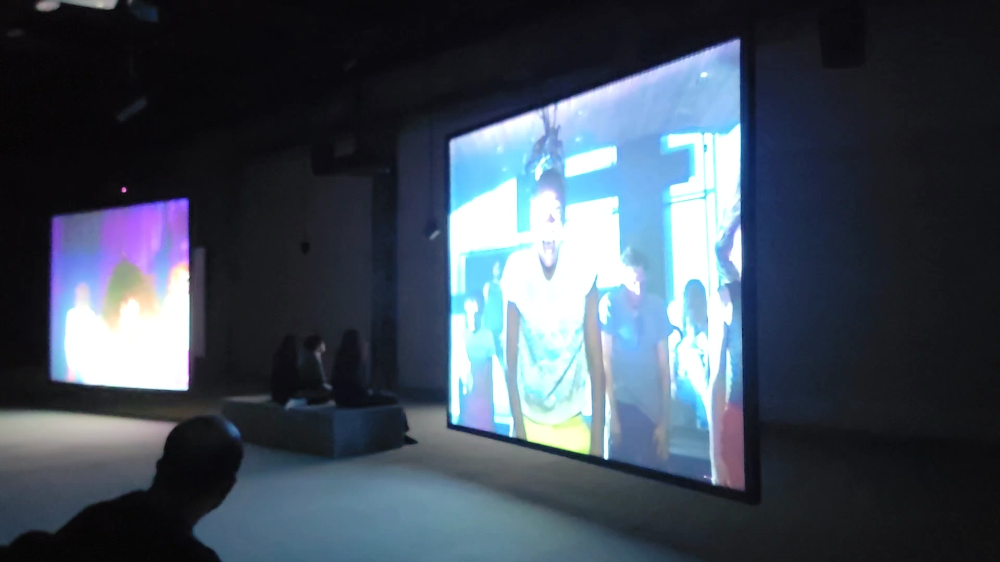

## **Fiche d'Oeuvre : Jeremy Shaw**

Jeremy Shaw est un artiste canadien basé à Berlin. Il est connu pour son travail dans le domaine de l'art contemporain, en particulier pour ses installations vidéo et ses œuvres explorant des thèmes liés à la conscience. Il a fait Phase Shifting Index, une exposition à Montréal et dans plusieurs autres endroit tel que en France et en Allemagne. J'Y suis allé le 31 janvier 2024. l'oeuvre a été réalisé en 2020. C'est une installation comteplative. L'oeuvre prend une grande pièce et le plafond est industriel. J'ai vécu une expérience qui m'a fait passé de l'admiration à l'incomfort et vice-versa.
Je n'aimerais pas retenir le fait que ça parle de drogue et que c'est très perturbant.

## L'information sempiternel
Nous rentrons dans une salle. 7 écrans se retrouvent face à nous. Sur chaque écran se retrouve une vidéo différente, de manière à croire que ça l'a été filmé durant différentes époques. Il y a des haut-parleurs placé au dessus qui sont des gens qui parlent dans la vidéo au-dessus de nos tête et des lumières accroché au plafond, mais qui ne font pas de lumière.

## Synchronisation révélatrice
Par la suite, toutes les personnes dans les clips se sont mis à faire la même chorégraphie.Les écrans flashait et les lumières aussi en blanc. la musique incomfortable nous calme et force à ne plus bouger.

## Effet glitch
Par la suite, les vidéos deviennent colorés avec des effets glitch simulant la prise de drogue. la musique devient vide et fade comme pour simuler la perte de conscience. La lumière change de couleur de façon un peu mouvementé.

## Vide coloré
Pour finir, les écrans se transforment en écran pouvant rappeler le vide, mais avec des couleurs hypnotisantes. la musique est plus calme et les lumières changent de couleurs de façon plus calme.

## Conclusion
J'ai trouvé l'oeuvre captivante et m'a donné comme idées de jouer avec les textures, tel que le plancher et les marches de tapis. J'ai aimé aussi le fait que toutes les vidéos était finalement connecté, et non filmés à différentes époques.
